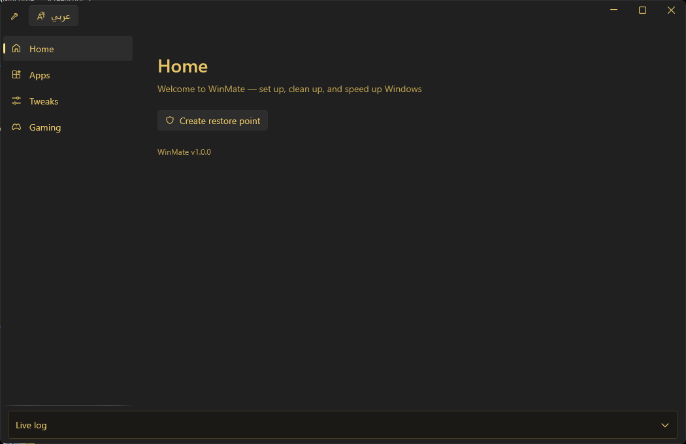
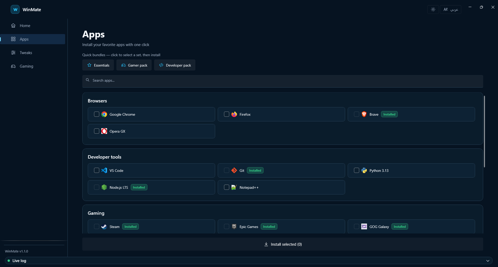
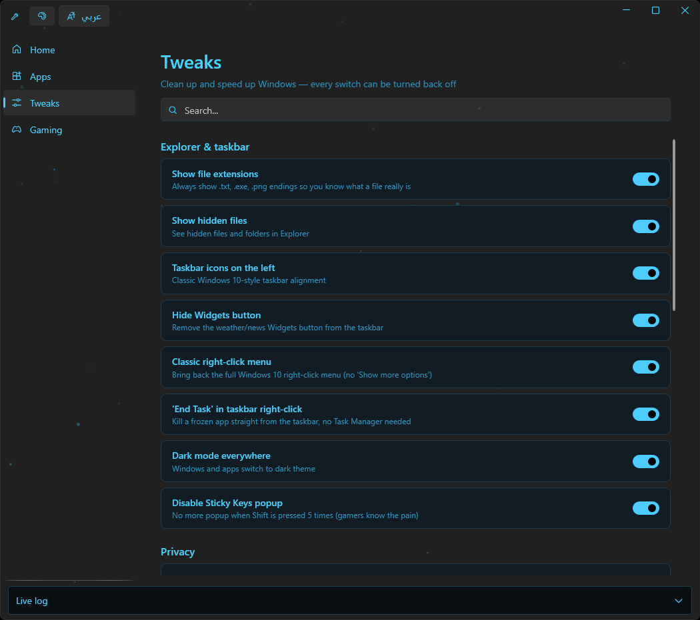
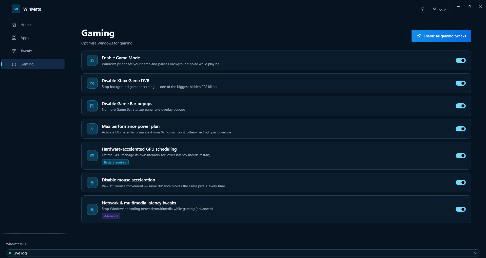
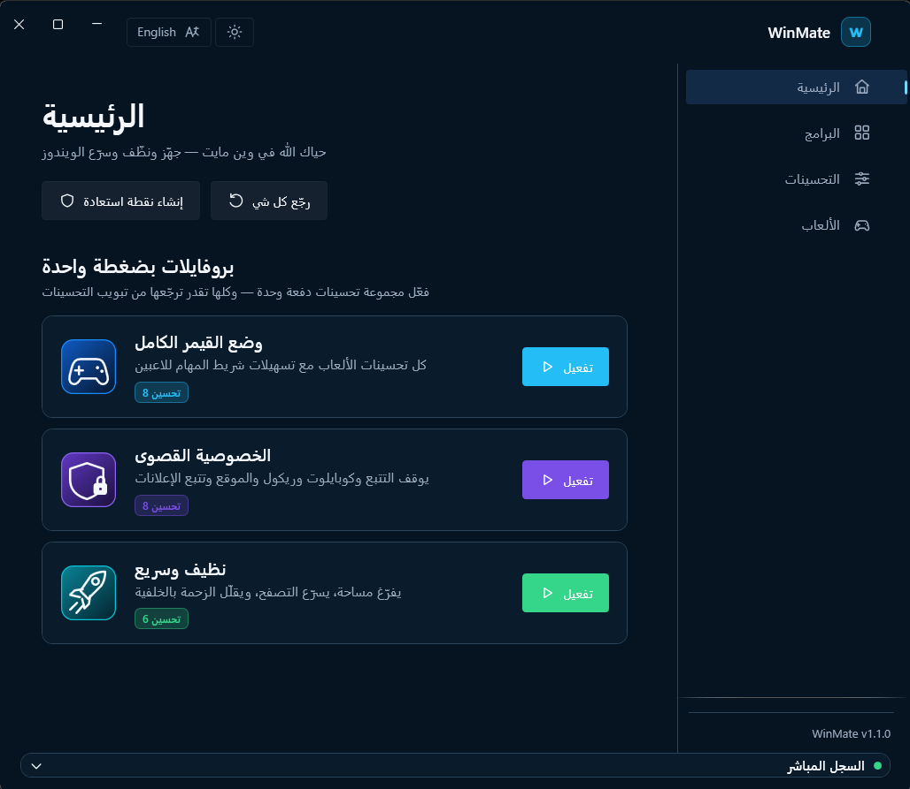

# WinMate 🔧

**A modern Windows utility — install apps, debloat, and optimize for gaming. Bilingual (English / العربية).**

**أداة ويندوز حديثة — ثبّت برامجك، نظّف النظام، وحسّنه للقيمنق. ثنائية اللغة (عربي / إنجليزي).**

 

> 🚧 **Actively developed** — regular updates with improvements and new features are coming.
>
> 🚧 **تحت التطوير المستمر** — بتنزل تحديثات دورية فيها تحسينات ومزايا أكثر.

---

## Screenshots / لقطات

### One-click profiles / بروفايلات بضغطة واحدة

Apply a whole set of tweaks at once — and everything stays reversible.



| Apps — bundles + one-click installs | Tweaks — every switch is reversible |
|---|---|
|  |  |

### Gaming optimizations / تحسينات الألعاب



### Full Arabic (RTL) support / دعم عربي كامل

The whole interface flips to Arabic with one click. Two themes are built in — a deep-blue default and a warm gold alternative — switchable from the title bar.

كل الواجهة تتحول للعربي بضغطة واحدة. وفيه ثيمين جاهزين — الأزرق الداكن الافتراضي والذهبي الدافي — تبدّل بينهم من شريط العنوان.



---

## Install / التثبيت

Run this one line in PowerShell / شغّل هذا السطر في PowerShell:

```powershell
irm https://raw.githubusercontent.com/Kha1idQ/winmate/main/scripts/install.ps1 | iex
```

Or download `WinMate.exe` from [Releases](../../releases) — no installation needed, just run it.

أو نزّل `WinMate.exe` من صفحة الإصدارات — ما يحتاج تثبيت، شغّله مباشرة.

## Features / المميزات

| | English | عربي |
|---|---|---|
| 📦 | **Apps** — install 22+ popular apps via winget with one click, with live progress log | **البرامج** — ثبّت أشهر البرامج بضغطة واحدة عبر winget مع سجل مباشر |
| 🔄 | **App manager** — list every installed program, update one or all of them, and uninstall — with clear warnings on Windows components so you never remove something critical by mistake | **مدير البرامج** — يعرض كل برنامج مثبَّت، حدّث واحد أو الكل، وأزِل — مع تحذير واضح على مكوّنات ويندوز عشان ما تحذف شي حرج بالغلط |
| 🛠️ | **Tweaks** — disable telemetry, debloat preinstalled apps, classic context menu, privacy switches — **every switch is reversible** | **التحسينات** — إيقاف التتبع، حذف البلوت، القائمة الكلاسيكية، مفاتيح الخصوصية — **كل مفتاح قابل للتراجع** |
| ❓ | **Explain this** — every tweak has an info button: what it changes, why you'd want it, an **honest** take on whether it really helps performance, the risks, and whether it needs admin/restart | **اشرح لي** — كل تحسين له زر معلومات: وش يغيّر، ليش تحتاجه، ورأي **صادق** هل يحسّن الأداء فعلًا، والمخاطر، وهل يحتاج مدير/ريستارت |
| 🎮 | **Gaming** — Game Mode, disable Xbox DVR, max performance power plan, GPU scheduling, raw mouse | **الألعاب** — وضع الألعاب، إيقاف Xbox DVR، خطة الطاقة القصوى، جدولة GPU، ماوس خام |
| 🛡️ | **Safety first** — offers a System Restore Point before your first change | **الأمان أولًا** — يعرض إنشاء نقطة استعادة قبل أول تعديل |
| 🌐 | **Arabic + English** — live language toggle with full RTL support | **عربي + إنجليزي** — تبديل حي مع دعم كامل للاتجاه من اليمين لليسار |

## Why WinMate? / ليش وين مايت؟

- Every toggle reads the **real system state** from the registry — not just what you clicked.
- Reversibility is a core feature: applied a tweak and changed your mind? Flip the switch back.
- Irreversible actions (debloat, temp clean) always show a confirmation with the exact list of what will happen.

- كل مفتاح يقرأ **حالة النظام الحقيقية** من الريجستري — مو مجرد شكل.
- القابلية للتراجع ميزة أساسية: فعّلت تويك وغيّرت رأيك؟ رجّع المفتاح وخلاص.
- الإجراءات النهائية (حذف البلوت، التنظيف) تعرض تأكيدًا بقائمة واضحة قبل التنفيذ.

## Requirements / المتطلبات

- Windows 10/11 (64-bit)
- Administrator rights (UAC prompt on launch) / صلاحيات مدير
- [winget](https://aka.ms/getwinget) for the Apps tab / لتبويب البرامج

## Build from source / البناء من المصدر

```powershell
git clone https://github.com/Kha1idQ/winmate.git
cd winmate/WinMate
dotnet run
```

## License

MIT
